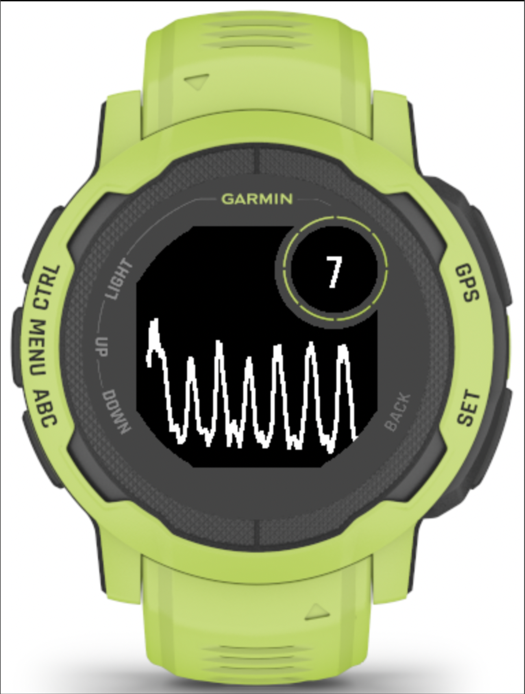
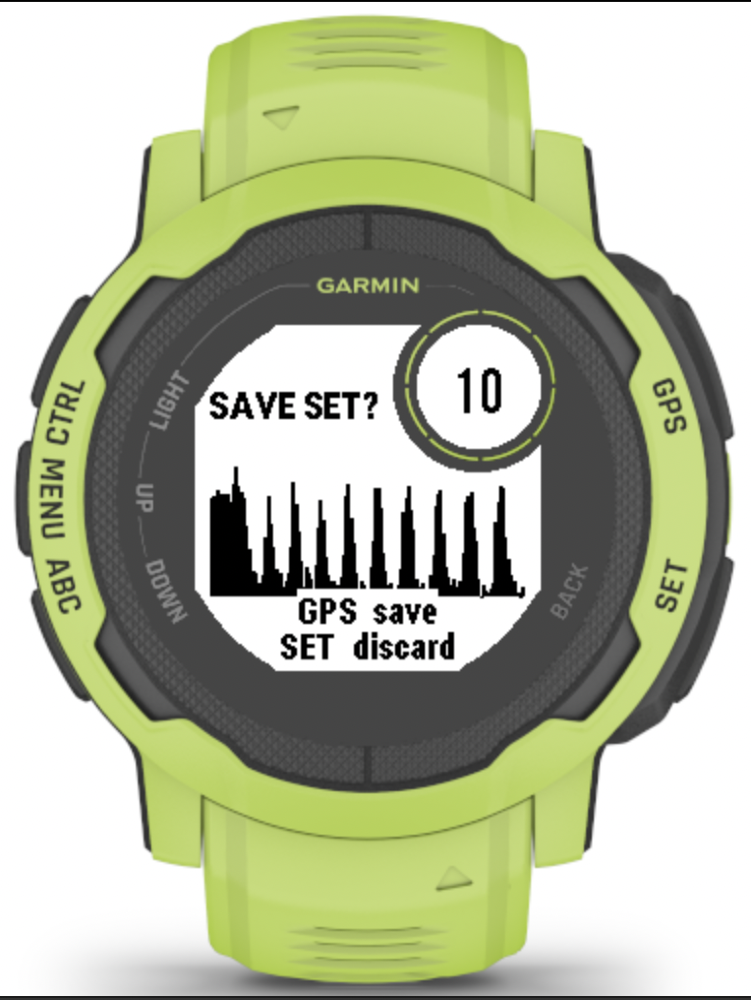
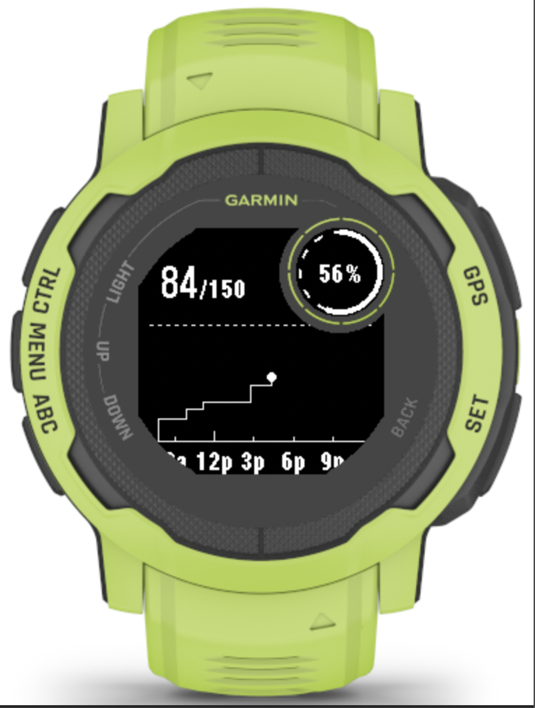
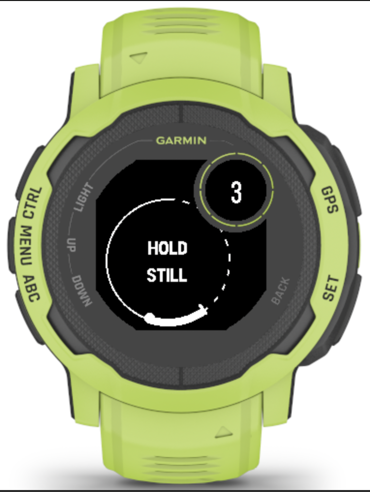
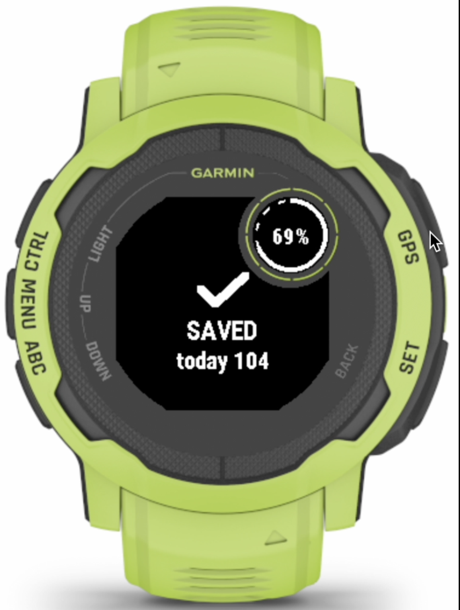

# Push-Up Counter — Garmin Instinct 2

An on-device push-up counter for the Garmin Instinct 2 that counts correctly,
built by measuring what the hardware actually does instead of trusting what
the datasheet says.

> **Status:** the watch app is feature-complete and validated on-device; the
> application source will be published here when v1 ships on the Connect IQ
> Store. In the meantime this repository is the full engineering record: the
> as-built design reference, the measurement methodology and its findings, and
> the QC capture tooling (Monkey C + Python) used to characterize the hardware.

Every algorithm decision in this app was arbitrated by real accelerometer
captures — pulled off the watch as FIT files via a dedicated QC capture app
and analyzed offline. The result is a detector that hit **10/10 accuracy
across normal, slow, and fast rep styles** in on-device validation, plus a set
of hardware findings that anyone writing sensor code for this device may find
useful (see [The hardware, as measured](#the-hardware-as-measured)).

Runs entirely on the watch. No phone required, no accounts, no backend.

  
  
  

<i>Live rep trace · set review waveform · daily burn-up chart.
Simulator renders of the shipping code — the trace and waveform are a replayed
real 10-rep capture fed through the production sensor path; the chart is a real
training day (84 reps across 5 sets).</i>

## What's in this repository

| Path | Contents |
|---|---|
| [`CHANGELOG.md`](CHANGELOG.md) | Versioned release history of the watch app |
| [`docs/pushup-app-reference.md`](docs/pushup-app-reference.md) | As-built reference: detector spec, measured signal facts, evidence ledger (including what *didn't* work), screens, persistence, tuned constants |
| [`docs/phase1_5-companion-plan.md`](docs/phase1_5-companion-plan.md) | Architecture plan for FIT data emission and a local-first phone companion |
| [`docs/phase2-capture-plan.md`](docs/phase2-capture-plan.md) | Capture-first plan for extending to sit-ups and squats, with pre-registered signal risks |
| [`qc-app/QcView.mc`](qc-app/QcView.mc) | The QC capture app (Monkey C): dual-stream accelerometer logging into FIT developer fields with a hands-free, vibration-cued protocol |
| [`tools/fit_qc_extract.py`](tools/fit_qc_extract.py) | FIT decoder for QC captures, with completeness proofs (sequence-gap detection), per-phase diagnostics, and poll-freshness measurement |
| [`tools/fit_accel_to_csv.py`](tools/fit_accel_to_csv.py) | Earlier-generation decoder for raw FIT accelerometer streams |

## Methodology

The project runs on a strict empiricism-over-assumption doctrine:

1. **Characterize before designing.** No detector logic is written until the
   signal is measured from real hardware via QC captures with known ground
   truth (fixed-duration holds, known rep counts, labeled protocol phases).
2. **Pre-register the questions.** Uncertain signal questions are written down
   before capture, so each QC session is designed to answer something specific.
3. **Log negative results.** Failed approaches go into an evidence ledger with
   the data that killed them, so they are never re-argued from intuition.
4. **Validate on-device.** The simulator's accelerometer is static; no accuracy
   claim is made without a sideloaded build counting real reps.
5. **Honest feedback only.** No cue ships unless it responds to real data — see
   the per-rep buzz story below.

## Features

- Accurate rep counting from the wrist accelerometer alone
- **Live signal trace** while you count: the last ~12 s of smoothed
  accelerometer data, body-oriented, advancing in real sensor batches — no
  interpolated animation, real data only
- **Review screen** with a full-set min/max waveform envelope before saving
- **Daily goal** with a burn-up chart (first set → midnight) and a goal lock:
  after the first set of the day, the morning goal becomes a floor
- Manual rep correction (UP/DOWN, ±1) during counting and review
- Rolling 60-set history in on-watch storage; midnight rollover; survives
  restarts

## How it counts

1. **Fresh calibration every set.** A 5-second countdown measures a baseline
   over its final 3 seconds while the user holds the top position; a jitter
   guard aborts if they weren't still.
2. **EMA smoothing** (α = 0.5) on the Y axis only — captures showed X and Z
   carry no usable push-up signal on the left wrist.
3. **Amplitude-from-trailing-minimum detection.** The detector arms, tracks
   the running minimum, and counts a rep when the smoothed signal rises
   200 mg above that trailing trough; it re-arms after falling 150 mg from the
   running peak. A ~1 s refractory suppresses double-counts.
4. **Nothing is compared against absolute levels.** The baseline drifts
   between sessions, and in-set rest settles *below* the calibration posture —
   both measured facts. Everything is relative to trailing extremes.

Design bias: **never miss a real rep.** An occasional false positive —
correctable in two button presses at the review screen — is the accepted
lesser evil.

  
  

<i>Per-set baseline calibration (left) and the save
confirmation with the fresh daily total (right).</i>

## The hardware, as measured

Established with the QC capture app in this repo, which writes raw
accelerometer batches into FIT developer fields for offline analysis:

| What the API accepts | What the hardware does |
|---|---|
| `sampleRate: 25` Hz | ~13.2 Hz real (~76 ms/sample) |
| 1-second listener period | 25-sample batches delivered every ~1.9 s |
| `Sensor.getInfo()` for instantaneous accel | Refreshes at ~0.2 Hz (6 distinct values across 499 polls at 50 ms) |

Consequence: **real-time per-rep feedback is physically impossible on this
device.** Any buzz or flash tied to a rep would land 0–1.9 s late. This app
therefore ships no per-rep cue at all — a scheduled/predictive buzz that
merely *pretends* to be responsive was rejected on principle. If it isn't
responding to real data, it doesn't ship.

## What didn't work (kept for the record)

- **Fixed-threshold trough crossing.** Smoothing flattens the raw downstroke
  spike (~−250 mg raw → ~−26 mg smoothed); any fixed-line approach fails.
- **Discriminating end-of-set watch reaches from real reps.** Every candidate
  feature — amplitude, cross-axis swing, rise time, locally-anchored travel
  time, trough depth — overlapped real reps in captured data. The review
  screen exists at exactly the only moment a reach phantom can occur, so
  correction beats rejection.

The complete evidence ledger, with the numbers, is in
[`docs/pushup-app-reference.md`](docs/pushup-app-reference.md).

## Roadmap

Current shipping version: **1.0.2** — see [CHANGELOG.md](CHANGELOG.md).

- **v1 store release** (Connect IQ Store) — in submission prep; source lands
  here when it ships
- **Data emission:** sets recorded as FIT activities with developer fields
  (per-rep timestamps, per-set stats) for Garmin Connect presence and offline
  analysis
- **Phone companion:** local-first analytics over Connect IQ device messaging —
  no backend, no accounts
- **More exercises:** sit-up and squat detectors are in the capture/
  characterization stage, following the same measure-first methodology

## License

MIT — see [LICENSE](LICENSE).

This project is not affiliated with or endorsed by Garmin Ltd.
