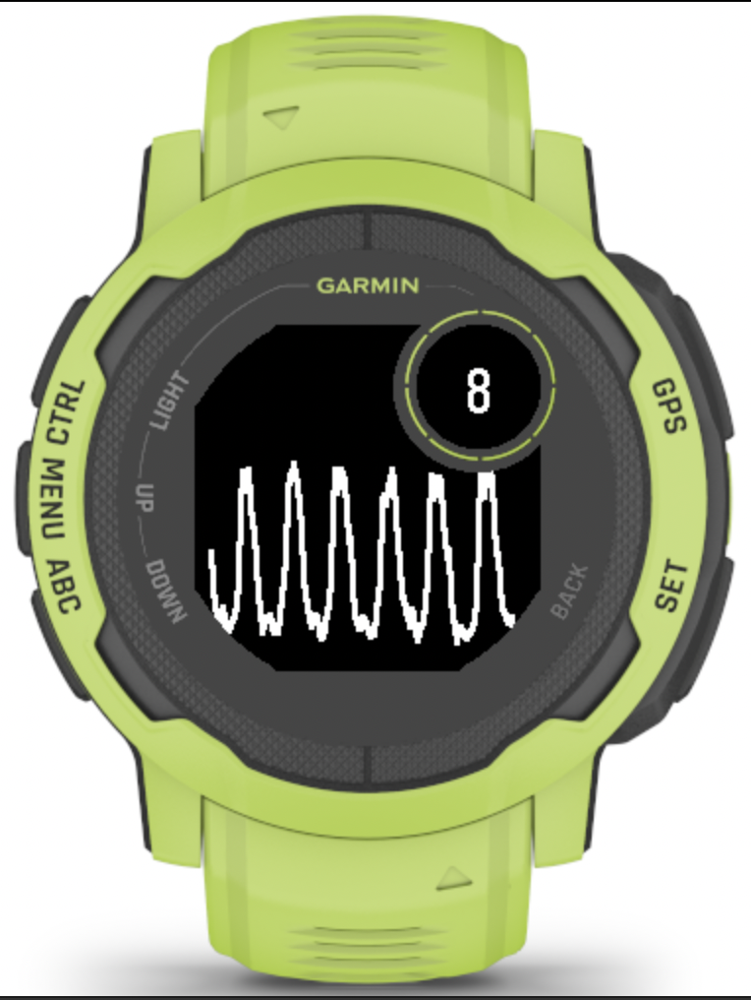
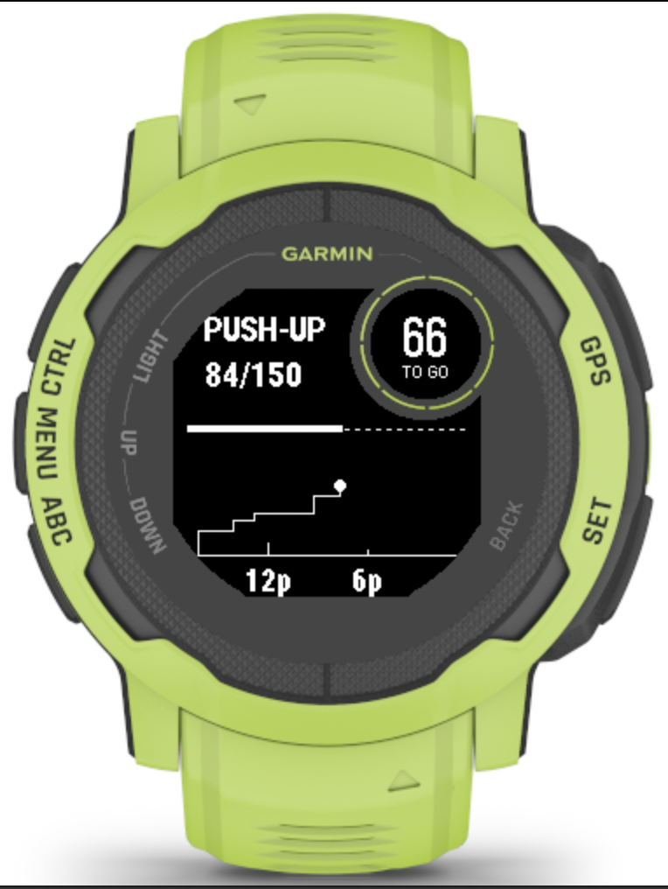
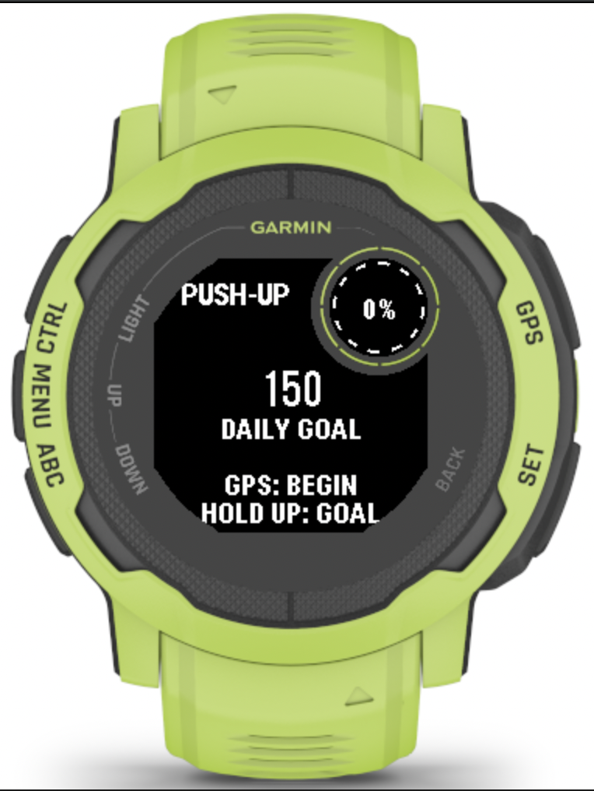
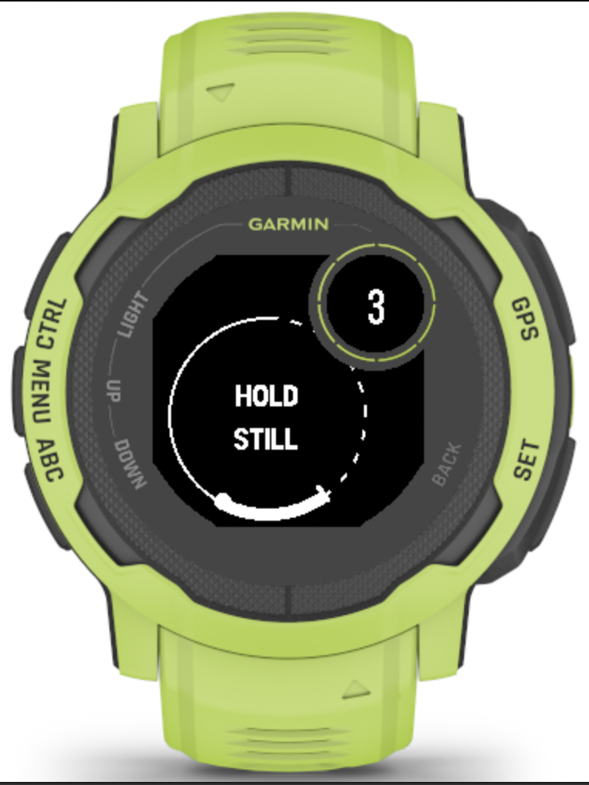
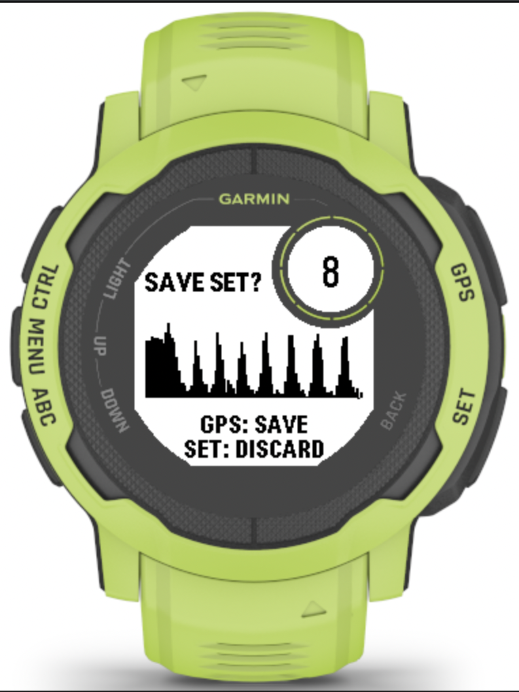
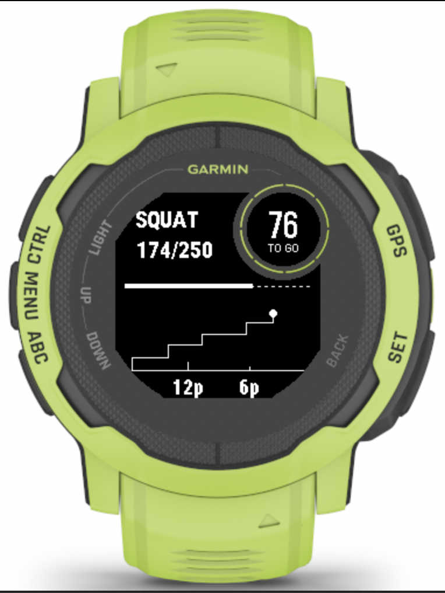
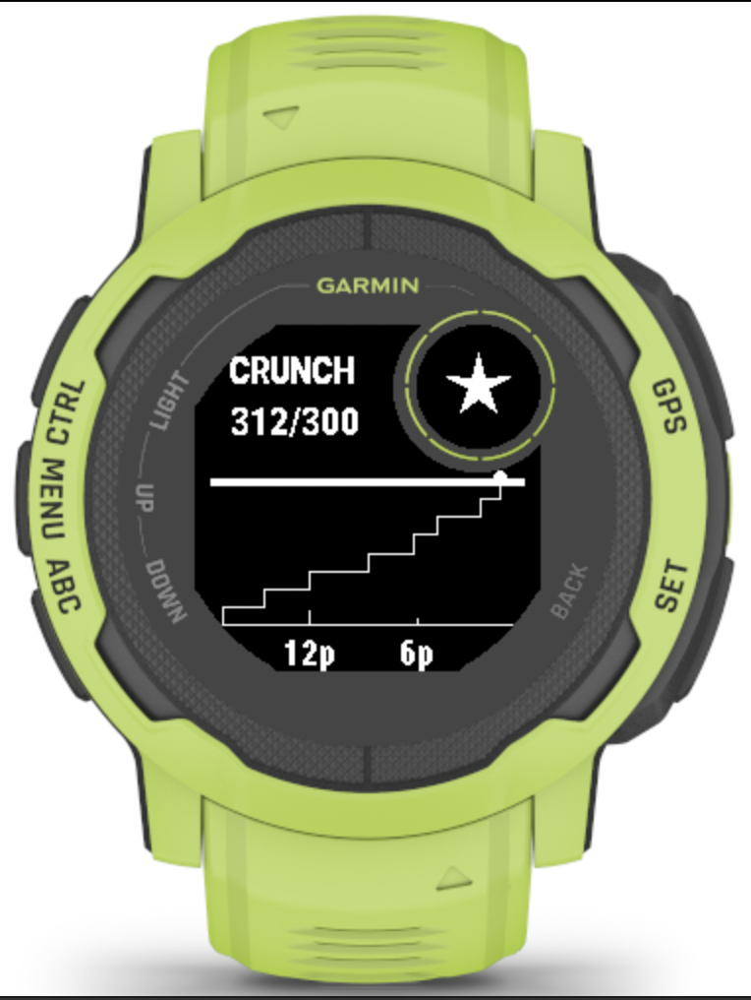

# SpareSet — Bodyweight Rep Counter for Garmin Instinct 2

Counts push-ups, squats, and crunches from the wrist accelerometer alone.
Fully on-device: no phone, no backend, no cloud. Built solo in Monkey C on
Connect IQ SDK 9.2.0 for the Garmin Instinct 2 (base model).

**Status: feature-complete, in daily dogfooding, working toward Connect IQ Store
submission.** Not yet published to the store.

  
  

---

## What this repository is

A **methodology and results showcase**, not a source drop.

The counting algorithm and its tuned constants are deliberately withheld until
the app is approved on the Connect IQ Store. What is public is the part that is
actually interesting to read: how the hardware was characterized, what the
measurements said, which features those measurements killed, and how the UI was
fitted to a display whose geometry had to be mapped by hand. The measurement
tooling — the FIT capture app and the Python decoders — is public in full.

| Public | Withheld |
| --- | --- |
| Hardware characterization + measured constants | Detector source (the counting code) |
| QC capture app source (`qc-app/`) | Tuned detector thresholds |
| Python analysis tooling (`tools/`) | Signing keys, shipping app-ids |
| Display constraint map, storage schema | — |
| Negative results and their evidence | — |

---

## The product

Two SKUs sharing one detector family:

- **Free** — push-ups only.
- **Paid** — push-ups, squats, and crunches.

A session runs entirely on the watch: pick an exercise, hold still briefly for
calibration, then reps count live against a daily goal. Sets are saved to
on-watch storage, totals roll over at local midnight, and hitting the goal
triggers a celebration. Button-only, monochrome, battery-conscious.

### Interface

| | | |
| :---: | :---: | :---: |
|  **Daily goal** |  **Stillness calibration** |  **Live counting** |
|  **Set review + save** |  **Squat goal reached** |  **Crunch goal reached** |

Every layout above is anchored to measured pixel boundaries rather than
estimates — see the display constraint map below.

---

## Hardware findings (measured, not from the datasheet)

Every number below came from instrumenting the device. Several contradict the
published specification, and each one changed a product decision.

| Finding | Measured value | Consequence |
| --- | --- | --- |
| Accelerometer sample rate | ~13.2 Hz real (~76 ms/sample) despite a 25 Hz request | All timing constants re-derived against wall time |
| Sample delivery | 25-sample batches every ~1.9 s | No sub-batch latency is achievable, period |
| `Sensor.getInfo()` refresh | ~0.2 Hz, stale | No low-latency sensor path exists |
| App RAM ceiling | ~91.8 kB | Bounded trace buffers and history caps |
| Sub-screen geometry | x113 y0 w62 h62, centre (144,31), R=31 | Layout anchored to measured pixels |
| Bezel occlusion | Uniform to sub-radius + 16 px | Safe-area insets derived, not guessed |
| `Dc.setScale` | Does not exist on this device | Custom 5×7 bitmap font authored instead |

The display map was produced by writing a **purpose-built instrumentation app**
whose only job was to report the panel's real geometry, rather than trusting
simulator output — the simulator's anti-aliasing actively misrepresents a 1-bit
MIP panel. Full results:
[`docs/instinct2-display-constraints.md`](docs/instinct2-display-constraints.md).

---

## Detection approach

A shared Y-axis rise detector over an EMA-smoothed signal, with per-exercise
amplitude and re-arm constant pairs and a minimum rep interval. Constants were
derived from captured data and **locked only after on-device validation** —
never from the simulator, whose accelerometer is static.

Governing rules, in priority order:

1. **Never miss a real rep.** An occasional false positive is correctable at the
   review screen; a missed rep is gone.
2. **Empiricism over assumption.** Characterize with real captures before
   designing.
3. **Honest feedback only.** No cue or statistic that isn't backed by real data.

---

## Analysis pipeline

Signal work runs offline against real captures:

1. [`qc-app/QcView.mc`](qc-app/QcView.mc) records an activity and writes **FIT
   files with FitContributor developer fields** carrying raw per-axis
   accelerometer data, under a hands-free vibration-cued capture protocol.
2. [`tools/fit_qc_extract.py`](tools/fit_qc_extract.py) decodes those captures
   with completeness proofs — sequence-gap detection, per-phase diagnostics, and
   poll-freshness measurement.
3. Detector behaviour is replayed and scored against hand-counted ground truth
   before any constant is considered for locking.

---

## Negative results

Findings that did not ship are recorded here on purpose. They cost real time,
and the reasoning is the useful part.

**Per-rep haptic feedback — cut.**
Measured delivery latency of 0–1.9 s, a direct consequence of batch sample
delivery. A buzz that lands up to two seconds after the rep is feedback that
lies. Predictive and scheduled alternatives were considered and rejected rather
than shipping a cue that could fire for a rep that never happened.

**Lunge detection — cut.**
Calibration measured roughly a 10 mg usable signal window at the wrist. Root
cause: an upright torso produces no forearm gravity-tilt arc for the sensor to
read. Replaced in the exercise set by a leaning squat with a sternum grip, which
measured a 379 mg calibration swing and ~886 mg peak-to-peak.

**End-of-set false-positive filter — cut.**
A known artifact: the terminal reach toward the stop button can resemble a rep.
Four independent discrimination methods were tested across 18 captured sets —
off-axis energy, per-axis jerk against the set envelope, a 3D fingerprint
z-score, and leave-one-out per-set outlier detection. **All four failed the
false-flag test**: legitimate reps scored as outliers as often as reaches. A
flag that cries wolf trains the user to ignore it, so the feature was killed and
the result written up instead.

---

## Storage schema

On-watch history is versioned from day one, with each version required to read
every older format. Schema v1 stores a capped rolling array of
`[epochSeconds, reps]` records plus daily goal state; the multi-exercise revision
extends records with an exercise identifier and migrates legacy two-field records
as push-ups. Full spec:
[`docs/storage-schema-reference.md`](docs/storage-schema-reference.md).

Note the architectural constraint that shapes the roadmap: `Application.Storage`
is **sandboxed per app-id**. No external application — including a custom watch
face — can read it. That, plus the Complications API requiring CIQ 4.x on a
device capped at API 3.4, means any watch-face display of live totals is
architecturally blocked on this hardware and would require a phone relay.

---

## Repository map

| Path | Contents |
| --- | --- |
| [`CHANGELOG.md`](CHANGELOG.md) | Development history and milestones |
| [`docs/instinct2-display-constraints.md`](docs/instinct2-display-constraints.md) | Measured display map: sub-screen geometry, bezel occlusion, safe drawing zones, rendering-API limits |
| [`docs/storage-schema-reference.md`](docs/storage-schema-reference.md) | Versioned on-watch storage record format, shared across exercises |
| [`docs/phase1_5-companion-plan.md`](docs/phase1_5-companion-plan.md) | Architecture plan for FIT data emission and a local-first phone companion |
| [`qc-app/QcView.mc`](qc-app/QcView.mc) | QC capture app (Monkey C): accelerometer logging into FIT developer fields with a hands-free, vibration-cued protocol |
| [`tools/fit_qc_extract.py`](tools/fit_qc_extract.py) | FIT decoder for QC captures, with completeness proofs, per-phase diagnostics, and poll-freshness measurement |
| [`tools/fit_accel_to_csv.py`](tools/fit_accel_to_csv.py) | Earlier-generation decoder for raw FIT accelerometer streams |
| `media/` | Screenshots from the running app |

---

## Roadmap

- [x] Push-up detector, on-device validated
- [x] Squat and crunch detectors, constants locked
- [x] Multi-exercise UI: burn-up chart, goal bar, custom bitmap font, celebration
- [x] Display constraint mapping
- [ ] Data emission layer — FIT activities with developer fields, per-rep timestamps
- [ ] Counting regression + Connect IQ Store submission
- [ ] Android companion (Kotlin, Connect IQ Mobile SDK) — local-first history
- [ ] Paid three-exercise SKU to store

---

## Built with

Monkey C · Connect IQ SDK 9.2.0 · Python (`fitdecode`, Pillow) · FIT protocol ·
VS Code on macOS

---

## License

MIT — see [LICENSE](LICENSE).

## Author

Nate — [github.com/njc707](https://github.com/njc707)
